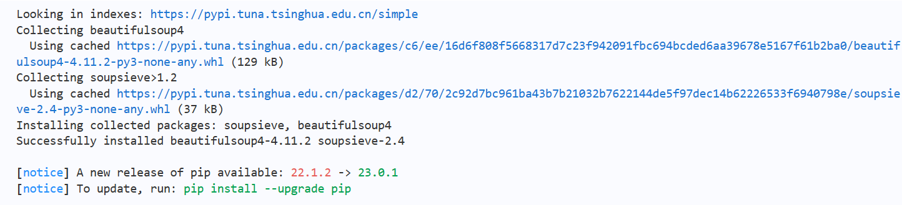
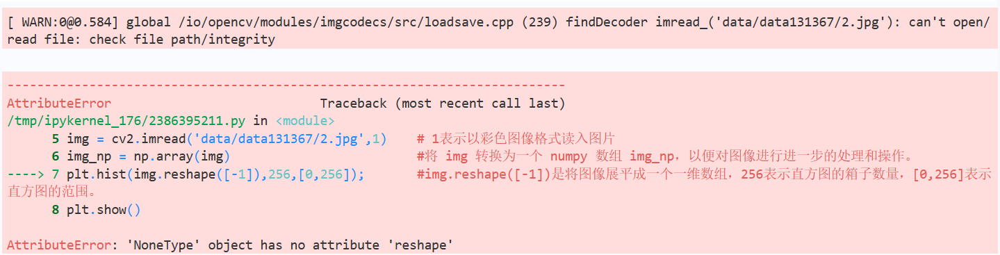
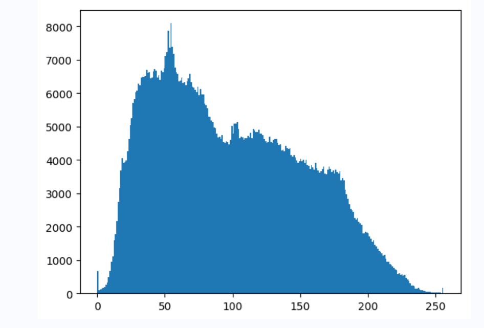
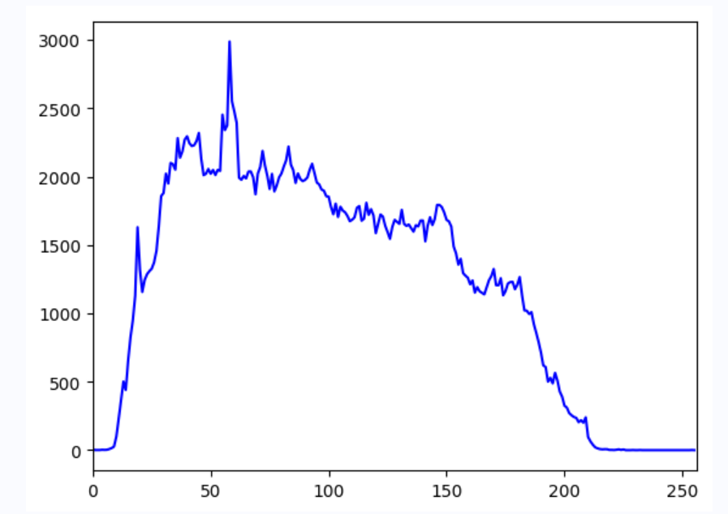
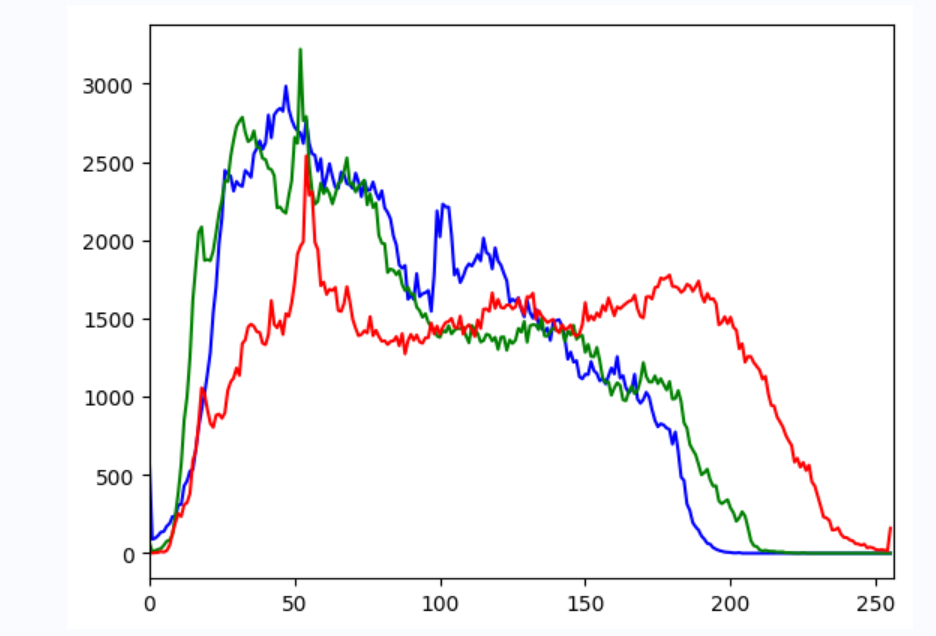
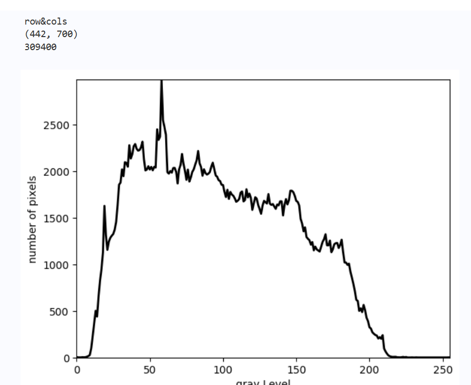
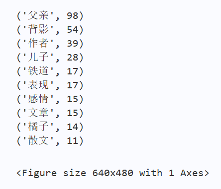
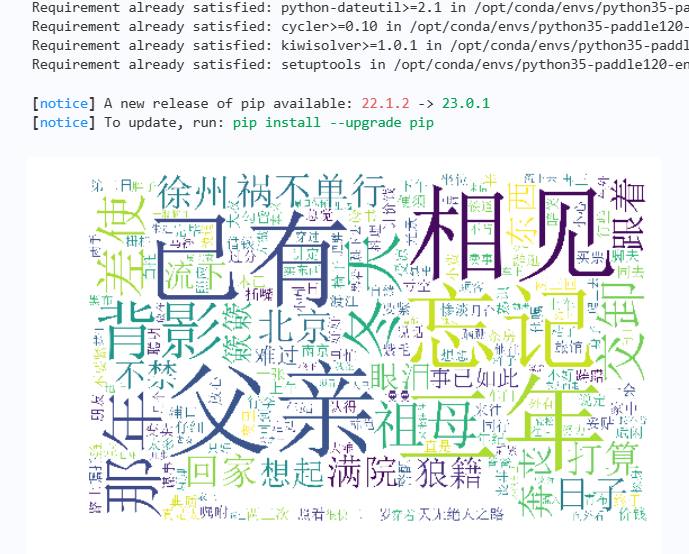
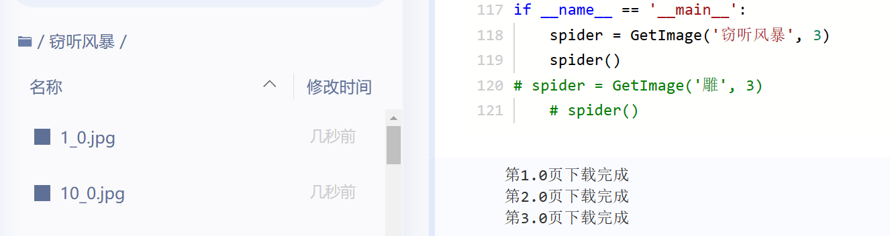
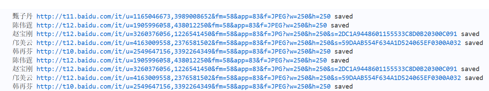

### 实验一：海量遍历文件
####  遍历文件名
```python
!tree -L 3 ./work/
#注意tree和-L和3之间的空格不能省略
#3代表遍历层数，如果有压缩包则无效   ./填写文件名/
```
#### 解压文件到指定目录

```python
import zipfile
import os        

#在python环境下对文件，文件夹执行操作的一个模块
#解压原始数据集，将src_path路径下的zip包解压至target_path目录下
def unzip_work(src_path,target_path):         
    #判断target_path是否为一个已存在的目录
    if(not os.path.isdir(target_path)):       
        #打开了src_path指定的zip文件
        z = zipfile.ZipFile(src_path, 'r')    
        #extractall()方法将zip文件中的所有文件解压缩到target_path指定的目录中。
        z.extractall(path=target_path)       
        z.close()

unzip_work('work/rename.zip','work/zip')
```

#### 统计给定目录所有的不同子文件类型及占用内存
```python
import os
size_dict = {}
type_dict = {}
def get_size_type(path):
    files = os.listdir(path)    #os.listdir(path)返回的是一个包含了指定目录下所有文件和文件夹名称的列表
    for filename in files:
        temp_path = os.path.join(path, filename)   #将path和filename组合成完整的文件路径，存储在temp_path变量中
        if os.path.isdir(temp_path):
            # 递归调用函数，实现深度文件名解析
            get_size_type(temp_path)     
        elif os.path.isfile(temp_path):
            # 获取文件后缀
            type_name=os.path.splitext(temp_path)[1]   #os.path.splitext()方法将文件路径分解为文件名和扩展名的元组，并返回扩展名（包括.）
            #os.path.splitext(path)方法将路径分成两部分：文件路径和扩展名，以元组 (root, ext) 的形式返回。
            #其中 root 为 path 中的文件路径，ext 为 path 中的文件扩展名（包括点号），如果 path 中没有扩展名，则 ext 为空字符串。
            
            #获取无后缀名的文件的相关信息
            if not type_name:
                #setdefault() 方法用于返回指定键的值，如果键不在字典中，就插入该键及其默认值（默认值为 None 或用户指定的默认值）
                type_dict.setdefault("None", 0)
                type_dict["None"] += 1
                # 获取文件大小
                size_dict.setdefault("None", 0)
                size_dict["None"] += os.path.getsize(temp_path)
            # 有后缀的文件
            else:
                type_dict.setdefault(type_name, 0)
                type_dict[type_name] += 1
                size_dict.setdefault(type_name, 0)
                size_dict[type_name] += os.path.getsize(temp_path) 
```

#### 输出
```python
path= "work/"
get_size_type(path)
for each_type in type_dict.keys():
    print ("%5s下共有【%5s】的文件【%5d】个,占用内存【%7.2f】MB" %     
            (path,each_type,type_dict[each_type],\
            size_dict[each_type]/(1024*1024)))
print("总文件数:  【%d】"%(sum(type_dict.values())))
print("总内存大小:【%.2f】GB"%(sum(size_dict.values())/(1024**3)))
```


***
### 实验三：图像直方图统计
#### 安装beautifulsoup4库
```python
#在AI Studio平台上创建一个名为“external-libraries”的目录
#并将beautifulsoup4库安装在此目录下      -t 参数表示指定安装路径
!mkdir /home/aistudio/external-libraries
!pip install beautifulsoup4 -t /home/aistudio/external-libraries
```

#### 快速启动
没搞懂sys库是干嘛的
```python
# 同时添加如下代码, 这样每次环境(kernel)启动的时候只要运行下方代码即可: 
# 将'/home/aistudio/external-libraries'添加到sys.path中，以便Python解释器在查找模块时能够找到该路径下的模块。
import sys 
sys.path.append('/home/aistudio/external-libraries')
```



#### 绘制直方图
```python
import cv2
import numpy as np                            # 导入NumPy库，并将其重命名为np，是一个开源的数学和科学计算库，用于处理大型多维数组和矩阵运算。
from matplotlib import pyplot as plt          #从Matplotlib库中导入pyplot子库，并将其重命名为plt 
     #pyplot是Matplotlib的绘图模块，用于制作各种类型的图表，如直方图、散点图、线图等。
img = cv2.imread('data/data131367/2.jpg',1)    # 1表示以彩色图像格式读入图片
img_np = np.array(img)                         #将 img 转换为一个 numpy 数组 img_np，以便对图像进行进一步的处理和操作。
plt.hist(img.reshape([-1]),256,[0,256]);       #img.reshape([-1])是将图像展平成一个一维数组，256表示直方图的箱子数量，[0,256]表示直方图的范围。
plt.show()
```

报错――――原因：图片路径不存在

成功


#### 绘制单条颜色的折线直方图
```python
import cv2
import numpy as np
from matplotlib import pyplot as plt

img = cv2.imread('data/data131367/2.jpg',0)     # 0表示以灰度图像格式读入图片。 获取直方图线的各种数据
# 计算灰度图像的直方图。其中，[img]表示输入的灰度图像，[0]表示通道数为0（灰度图像只有一个通道），None表示不使用掩膜，[256]表示直方图的箱子数量，[0,256]表示直方图的范围。
histr = cv2.calcHist([img],[0],None,[256],[0,256]) 
plt.plot(histr,color = 'b')   #用于绘制直方图的线条，其中 histr 是使用 cv2.calcHist 函数计算出的直方图数据，color = 'b' 则指定线条颜色为蓝色。
plt.xlim([0,256])             # 用于设置 X 轴的范围，由于直方图的范围是 0 到 255，因此这里设置为 [0, 256]。
plt.show()
```




#### 绘制多条颜色的折线直方图
```python
import cv2
from matplotlib import pyplot as plt
img = cv2.imread('data/data131367/2.jpg',1) 
color = ('b','g','r')
# 遍历每个颜色捏
for i,col in enumerate(color):
    histr = cv2.calcHist([img],[i],None,[256],[0,256])
    plt.plot(histr,color = col)
    plt.xlim([0,256])
plt.show()
```



#### 绘制灰度直方图
```python
import sys
import numpy as np
import cv2
import matplotlib.pyplot as plt

def main():
    img=cv2.imread('data/data131367/2.jpg',0)
    #得到计算灰度直方图的值
    n = np.array(img)
    xy=xygray(img)    #该函数将计算图像的灰度直方图并返回一个形状为 (256,) 的一维数组 xy。该数组包含了图像中每个灰度级别的像素数量。

    #画出灰度直方图
    x_range=range(256)               # 表示横坐标的范围
    plt.plot(x_range,xy,"r",linewidth=2,c='black')    # xy存储着灰度直方图的数据。r表示红色，linewidth 表示线条宽度，c 表示线条颜色
    #设置坐标轴的范围
    y_maxValue=np.max(xy)            #计算灰度直方图y轴的最大值
    plt.axis([0,255,0,y_maxValue])   #设置坐标轴的范围，其中[0, 255]表示x轴范围，[0, y_maxValue]表示y轴范围。这里将x轴范围设置为0到255，y轴范围则根据灰度值的最大值确定。
    #设置坐标轴的标签                 #给绘制的直方图添加 x 轴和 y 轴的标签
    plt.xlabel('gray Level')
    plt.ylabel("number of pixels")
    plt.show()

def xygray(img):
    #得到高和宽
    rows,cols=img.shape   #获取了图像的行数和列数
    # img.shape 是一个包含三个元素的元组，表示图像的高度、宽度和通道数。如果是灰度图像，通道数为1。
    # 因此，rows 和 cols 分别对应图像的高度和宽度。
    print("row&cols")
    print(img.shape)
    #存储灰度直方图
    #它通过遍历图像的每个像素，统计出每个灰度级别（0-255）在图像中出现的像素数目，并将结果存储在一个大小为256的一维数组 xy 中。这个数组中的每个元素表示一个灰度级别对应的像素数目。
    xy=np.zeros([256],np.uint64)   
    for r in range(rows):
        for c in range(cols):
            xy[img[r][c]] += 1
    #返回一维ndarry
    print(xy.sum())
    return xy

main()
```


***
### 实验四：文本词频分析
#### 分词并统计次数
```python
import jieba # jieba中文分词库

with open('data/data131368/test.txt', 'r', encoding='UTF-8') as novelFile:
    novel = novelFile.read()
# print(novel)
stopwords = [line.strip() for line in open('data/data131368/stop.txt', 'r', encoding='UTF-8').readlines()]   #readlines函数读取文件中的每一行并返回一个字符串列表。列表中的每个元素都对应于文本文件中的一行
 #对其中的每一行使用strip()方法去掉了首尾的空白符。然后将所有的停用词存储在了一个列表stopwords中。
novelList = list(jieba.lcut(novel))   #使用了jieba库中的lcut方法，将名为novel的文本进行了分词，得到了包含了所有分词后的词语的列表
novelDict = {}

# 统计出词频字典
for word in novelList:
    if word not in stopwords:
            # 不统计字数为一的词
            if len(word) == 1:
                continue
            else:
                novelDict[word] = novelDict.get(word, 0) + 1  #使用了字典的 get() 方法，这个方法接受两个参数：要查找的键和默认值。如果要查找的键在字典中存在，则返回该键对应的值；如果要查找的键不存在，则返回默认值。最后都要+1

# 对词频进行排序

#使用字典的 items() 方法，将 novelDict 字典转化为包含所有键值对的元组列表。
# list() 将元组列表转化为普通列表，保存到 novelListSorted 变量中
novelListSorted = list(novelDict.items())
#将列表中的每个元素 e 的第二个元素（即键值对中的值，词出现的次数）作为排序的依据
# reverse=True：从大到小排序
novelListSorted.sort(key=lambda e: e[1], reverse=True)

# 打印前20词频  输出格式为一个元组，包含单词和对应的出现次数。
topWordNum = 0
for topWordTup in novelListSorted[:20]:
    print(topWordTup)

from matplotlib import pyplot as plt
# x，y为列表；c，v为临时变量，用于保存novelListSorted的元素
x = [c for c,v in novelListSorted]  #c表示的是每次单词本身
y = [v for c,v in novelListSorted]  #v表示的是每个单词出现次数
plt.plot(x[:20],y[:20],color='b')   #[:20]切片操作，只取前20个
plt.show()
```


#### 画词云图
```python
!pip install wordcloud
from wordcloud import WordCloud,ImageColorGenerator   #wordcloud用于生成词云的 Python 库   ImageColorGenerator用于生成图像颜色生成器的 Python 类
import jieba   
import matplotlib.pyplot as plt   #用于绘制数据可视化图形的 Python 库
from imageio import imread  #用于读取图像数据的 Python 函数
 

#读入背景图片
bg_pic = imread('data/data131368/6e6432ce-ce7d-4e48-b367-24e157e48320-14394966.jpg')
#生成词云图片
#  mask=bg_pic：将背景图片作为遮罩，即生成的词云图片将填充到背景图片中
#  scale=1.5：指定词云图片的缩放比例为 1.5，即生成的图片会比原图稍微放大一些
#  ont_path=r'msyh.ttc'：指定词云使用的字体为微软雅黑字体
#  generate(' '.join(novelDict.keys()))：生成词云图片。在生成之前，将 novelDict 字典中所有的键（即文本中的单词）以空格为分隔符连接成一个字符串，作为 WordCloud 类的输入文本。根据输入文本和前面的参数配置，WordCloud 类会生成一个词云图片并返回词云对象。
wordcloud = WordCloud(mask=bg_pic,background_color='white',\
    scale=1.5,font_path=r'data/data131368/msyh.ttc').generate(' '.join(novelDict.keys()))
plt.imshow(wordcloud)  #使用 imshow 函数将 wordcloud 作为参数，可以在屏幕上显示生成的词云图片。
plt.axis('off')        #关闭坐标轴。
plt.show()
#保存图片
wordcloud.to_file('父亲.jpg') #使用 to_file 方法将词云对象保存为一个图片文件，并将文件名指定为 '父亲.jpg'。
```



### 实验五：明星图片爬取
#### 通过确定方法对象名获取图片
```python
import requests   #用于发起 HTTP 请求和处理响应的库
import os         #用于提供与操作系统交互的接口。在这个代码中，可能是用于操作文件、文件夹和路径。
import urllib     #包含了一些用于处理 URL 的模块
#虽然这三个模块都可以用于发送 HTTP 请求和下载文件，但它们的使用方式有所不同，具体使用哪个模块要根据具体的需求和场景来决定。


class GetImage():
    # 构造函数，用于初始化类的属性。
    def __init__(self,keyword='大雁',paginator=1):  #keyword表示要搜索的关键词，paginator表示要搜索的页数
        # 分别表示请求链接、请求头和下载图片时的请求头
        self.url = 'http://image.baidu.com/search/acjson?'
        #User-Agent 是一个 HTTP 请求头的字段，用于向服务器发送关于客户端代理程序的信息。它告诉服务器客户端使用的浏览器类型和版本号，操作系统类型和版本号以及其他相关信息。
        #在这个例子中，User-Agent 字段的值表示客户端使用的浏览器是 Chrome 69.0.3497.81，运行在 Windows 10 
        #Windows NT10.0; WOW64表示64 位版本的 Windows 操作系统
        #Safari/537.36为了增加客户端的兼容性
        self.headers = {
            'User-Agent': 'Mozilla/5.0 (Windows NT\
             10.0; WOW64) AppleWebKit/537.36\
              (KHTML, like Gecko) Chrome/69.0.\
            3497.81 Safari/537.36'}
        self.headers_image = {
            'User-Agent': 'Mozilla/5.0 (Windows\
             NT 10.0; WOW64) AppleWebKit/537.36 \
             (KHTML, like Gecko) Chrome/69.0.\
            3497.81 Safari/537.36',
            # Referer 值的作用是告诉服务器当前请求的来源是什么
            'Referer': 'http://image.baidu.com/\
            search/index?tn=baiduimage&ipn=r&\
            ct=201326592&cl=2&lm=-1&st=-1&\
            fm=result&fr=&sf=1&fmq=1557124645631_R&\
            pv=&ic=&nc=1&z=&hd=1&latest=0&copyright\
            =0&se=1&showtab=0&fb=0&width=&height=\
            &face=0&istype=2&ie=utf-8&sid=&word=%\
            E8%83%A1%E6%AD%8C'}
        self.keyword = keyword      # 定义关键词
        self.paginator = paginator  # 定义要爬取的页数

    def get_param(self):
        # urllib.parse.quote()：Python中将中文关键词转换为URL编码格式，以便在URL中使用
        keyword = urllib.parse.quote(self.keyword)
        #用于存储所有的链接参数
        params = []
        # 为爬取的每页链接定制参数
        for i in range(1, self.paginator + 1):
            #n：搜索结果页面的类型，这里指定为resultjson_com。    ipn：图片的页面类型，这里指定为rj，表示结果为JSON格式。
            #ct：图片颜色类型，这里指定为201326592，表示不限颜色。 is：图片大小类型，这里留空，表示不限大小。
            #fp：图片来源类型，这里指定为result，表示从搜索结果中获取图片。 queryWord：查询的关键词，这里使用keyword变量，经过URL编码后的中文关键词。
            #cl：查询的图片类型，这里指定为2，表示搜索的是全部图片类型。     lm：图片的时间类型，这里指定为-1，表示不限时间。
            #ie：输入编码格式，这里指定为utf-8。                   oe：输出编码格式，这里指定为utf-8。
            #adpicid：图片ID，这里留空。                          st：图片搜索类型，这里指定为-1，表示不限图片搜索类型。
            #z：图片分辨率，这里留空。                             ic：图片分类，这里留空。
            #hd：是否高清，这里指定为1，表示只搜索高清图片。         latest：是否最新，这里指定为0，表示不限时间。
            #copyright：是否版权。                                word：查询的关键词，这里使用keyword变量，经过URL编码后的中文关键词。
            #s：搜索结果。         se：搜索引擎类型。              tab：搜索结果页面的标签类型。
            #width：图片的宽度，留空。     height：图片的高度，留空。   face：是否为人脸图片，这里指定为0，表示不限。
            #istype：图片类型，这里指定为2，表示搜索全部类型的图片。     qc：查询条件，这里留空。
            #nc：图片数量，这里指定为1，表示只搜索一页的图片。           fr：搜索来源，这里留空。
            #expermode：搜索模式，这里留空。    force：是否强制搜索，这里留空。 cg：图片分类，这里指定为star。
            #pn：当前页码，这里使用循环变量i计算得到。     rn：每页显示的图片数量，这里指定为30。
            params.append(
                'tn=resultjson_com&ipn=rj&ct=201326592&is=&\fp=result&queryWord={}&cl=2&lm=-1&ie=utf-8&o\
                e=utf-8&adpicid=&st=-1&z=&ic=&hd=1&latest=0&\copyright=0&word={}&s=&se=&tab=&width=&height=&face=0&istype=2&\
                qc=&nc=1&fr=&expermode=&force=&cg=star&pn={}&rn=30&gsm=78&1557125391211='.format(keyword, keyword, 30 * i))
                #字符串格式化操作，用于将字符串中的占位符替换为相应的值。在这个参数字符串中，使用了三个占位符 {}，分别表示查询关键词、页码和每页图片数量。
        return params   # 返回链接参数

    def get_urls(self, params):
        urls = []
        # params参数是一个列表，包含了所有图片页面的链接参数
        for param in params:
            # 拼接每页的链接
            urls.append(self.url + param)
        return urls   # 返回每页链接

    def get_image_url(self, urls):
        image_url = []
        for url in urls:
            # 使用 requests 模块发送 GET 请求获取该页面的搜索结果。将获取的结果解析为 JSON 格式的数据
            json_data = requests.get(url, headers=self.headers).json()
            # 获取图片中的数据信息
            json_data = json_data.get('data')
            for i in json_data:
                # 如果信息不为空
                if i:
                    # 从图片信息中获取其缩略图的 URL，将其添加到 image_url 列表中   'thumbURL' 是一个键，用于获取该字典中对应的值，即缩略图的 URL
                    image_url.append(i.get('thumbURL'))
        return image_url

    def get_image(self, image_url):
        """
        根据图片url，在本地目录下新建一个以搜索关键字命名的文件夹，然后将每一个图片存入。
        :param image_url:
        :return:
        """
        cwd = os.getcwd()  # 获取当前工作目录
        file_name = os.path.join(cwd, self.keyword)  #将当前工作目录和搜索关键字拼接成文件夹名称 file_name
        if not os.path.exists(self.keyword):         #如果该文件夹不存在，则使用 os.mkdir 方法创建该文件夹。
            os.mkdir(file_name)
            # enumerate将一个可迭代对象（如列表、元组、字符串、字典等）转化为枚举对象，同时返回每个元素的索引和对应的值
        for index, url in enumerate(image_url, start=1):
            # '{}_0.jpg'.format(index) 是一个字符串格式化的表达式，用于生成图片的文件名。其中 {} 是一个占位符，而变量的值则由后面的 format(index) 提供。最终生成的文件名形如 1_0.jpg等
            # 'wb' 是以二进制写入模式打开文件的标志，确保在写入图片时不会对其进行编码或解码
            with open(file_name+'/{}_0.jpg'.format(index), 'wb') as f:          #打开文件并写入数据。
                f.write(requests.get(url, headers=self.headers_image).content)  #发送 GET 请求使用 response.content 属性获取图片的二进制数据 
            if index != 0 and index % 30 == 0:      #在每下载 30 张缩略图后提示当前下载进度。
                print('第{}页下载完成'.format(index/30))

    def __call__(self, *args, **kwargs):
        params = self.get_param()  # 获取链接参数
        urls = self.get_urls(params) # 将参数列表转化为每页图片的链接列表 urls
        image_url = self.get_image_url(urls) # 获取所有图片的链接列表 image_url
        self.get_image(image_url)  #将图片下载到本地

if __name__ == '__main__':
    spider = GetImage('明星', 3)
    spider()
# spider = GetImage('雕', 3)
    # spider()
```



#### 通过api获取图片[自己改没改成功(；′⌒`)]
```python
# 首先我们要导入相关的包
# request：提供爬虫相关的接口函数
# json：主要负责处理字典类型数据在字符串与字典之间进行转换
import requests
import json
import os


# 直接使用程序爬取网络数据会被网站识别出来，然后封禁该IP，导致数据爬取中断，所以我们需要首先将程序访问页面伪装成浏览器访问页面
# User-Agent：定义一个真实浏览器的代理名称，表明自己的身份（是哪种浏览器），本demo为谷歌浏览器
# Accept：告诉WEB服务器自己接受什么介质类型，*/* 表示任何类型
# Referer：浏览器向WEB服务器表明自己是从哪个网页URL获得点击当前请求中的网址/URL
# Connection：表示是否需要持久连接
# Accept-Language：浏览器申明自己接收的语言
# Accept-Encoding：浏览器申明自己接收的编码方法，通常指定压缩方法，是否支持压缩，支持什么压缩方法（gzip，deflate）
def getPicinfo(url):
    headers = {
        "User-Agent": "Mozilla/5.0 (Windows NT 6.1; Win64; x64) AppleWebKit/537.36 (KHTML, like Gecko) Chrome/81.0.4044.129 Safari/537.36",
        "Accept": "*/*",
        "Referer": "https://www.baidu.com/s?ie=utf-8&f=8&rsv_bp=1&rsv_idx=1&tn=baidu&wd=%E4%B8%AD%E5%9B%BD%E8%89%BA%E4%BA%BA&fenlei=256&rsv_pq=cf6f24c500067b9f&rsv_t=c2e724FZlGF9fJYeo9ZV1I0edbhV0Z04aYY%2Fn6U7qaUoH%2B0WbUiKdOr8JO4&rqlang=cn&rsv_dl=ib&rsv_enter=1&rsv_sug3=15&rsv_sug1=6&rsv_sug7=101",
        #"Referer": "https://www.baidu.com/s?ie=utf-8&f=8&rsv_bp=1&rsv_idx=1&tn=baidu&wd=%E6%A8%A1%E6%8B%9F%E6%B8%B8%E6%88%8F&fenlei=256&rsv_pq=88776f96000b1fc4&rsv_t=5966lAqM5w8EkSyO3f5BPyALDMfpycmiyZVxx803Glr9imPdr8%2F85ZNynAo&rqlang=cn&rsv_dl=tb&rsv_enter=1&&rsv_sug3=31&rsv_sug1=20&rsv_sug7=100",
        #"Referer": "https://www.baidu.com/s?tn=15007414_1_dg&ie=utf-8&wd=%E4%B8%AD%E5%9B%BD%E9%9F%B3%E4%B9%90%E5%AE%B6",
        "Host": "sp0.baidu.com",
        "Connection": "keep-alive",
        "Accept-Language": "en-US,en;q=0.9,zh-CN;q=0.8,zh;q=0.7,zh-TW;q=0.6",
        "Accept-Encoding": "gzip, deflate"
    }
    # 根据url，使用get()方法获取页面内容，返回相应
    response = requests.get(url,headers)  
    #  HTTP 响应的状态码是否成功访问了页面
    if response.status_code == 200:
        return response.text
    return None

#图片存放地址
Download_dir='testpicture'
if os.path.exists(Download_dir)==False:
    os.mkdir(Download_dir)

pn_num=5  #  爬取多少页
rn_num=5  #  每页多少个图片

for k in range(pn_num):  # for循环，每次爬取一页
#  是一个百度的 API 请求 URL。它用于获取与查询参数 query 的值相关的信息，  %E4%B8%AD%E5%9B%BD%E8%89%BA%E4%BA%BA  means 中国艺人
	url="https://sp0.baidu.com/8aQDcjqpAAV3otqbppnN2DJv/api.php?resource_id=28266&from_mid=1&&format=json&ie=utf-8&oe=utf-8&query=%E4%B8%AD%E5%9B%BD%E8%89%BA%E4%BA%BA&sort_key=&sort_type=1&stat0=&stat1=&stat2=&stat3=&pn="+str(k)+"&rn="+str(rn_num)+"&_=1613785351574"
    #url="https://sp0.baidu.com/8aQDcjqpAAV3otqbppnN2DJv/api.php?resource_id=28266&from_mid=1&&format=json&ie=utf-8&oe=utf-8&query=%E6%A8%A1%E6%8B%9F%E6%B8%B8%E6%88%8F&sort_key=&sort_type=1&stat0=&stat1=&stat2=&stat3=&pn="+str(k)+"&rn="+str(rn_num)+"&_=1613785351574"
	#url="https://sp0.baidu.com/8aQDcjqpAAV3otqbppnN2DJv/api.php?resource_id=28266&from_mid=1&format=json&ie=utf-8&oe=utf-8&query=%E4%B8%AD%E5%9B%BD%E9%9F%B3%E4%B9%90%E5%AE%B6&sort_key=&sort_type=1&stat0=&stat1=&stat2=&stat3=&pn="+str(k)+"&rn="+str(rn_num)+"&_=1613785351574"

	res = getPicinfo(url)       # 调用函数，获取每一页内容
	json_str=json.loads(res)    # 将获取的文本格式转化为字典格式
	figs=json_str['data'][0]['result']   # 从 JSON 对象中提取出了键为 'data' 的值的第一个元素（即索引为 0 的元素）中键为 'result' 的值。
	
	for i in figs:              # for循环读取每一张图片的名字
		name=i['ename']
		img_url=i['pic_4n_78']  # img_url：图片地址
		img_res=requests.get(img_url)  # 读取图片所在页面内容
		if img_res.status_code==200: 
			ext_str_splits=img_res.headers['Content-Type'].split('/')  # 从响应头中提取出 'Content-Type'(文件类型)字段的值，并使用 split('/') 函数将其分割为一个列表
			ext=ext_str_splits[-1]  # 索引-1指向列表倒数第一个元素
			fname=name+"."+ext      # 文件名
            # 保存图片
			open(os.path.join(Download_dir,fname),  'wb' ).write(img_res.content) # 将图片内容（即 img_res.content) 保存到一个指定的文件中
			print(name,img_url,"saved")
```



