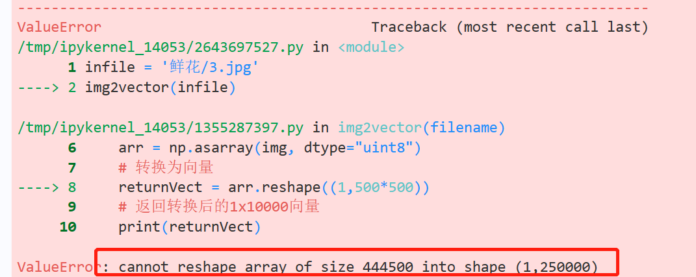

## 计算机视觉

### 代码使用手册
```python
# 查看当前挂载的数据集目录, 该目录下的变更重启环境后会自动还原
!ls /home/aistudio/data

# 查看工作区文件, 该目录下的变更将会持久保存. 请及时清理不必要的文件, 避免加载过慢.
!ls /home/aistudio/work

# 如果需要进行持久化安装, 需要使用持久化路径, 如下方代码示例:
!mkdir /home/aistudio/external-libraries
!pip install beautifulsoup4 -t /home/aistudio/external-libraries

# 同时添加如下代码, 这样每次环境(kernel)启动的时候只要运行下方代码即可: 
import sys 
sys.path.append('/home/aistudio/external-libraries')
```


### 实验一：文件名称批量修改
Q:怎么导入现有数据集而不是下载再上传04
```python
import os
 
# 函数功能：批量修改文件夹路径下所有文件的文件名，此处以在原文件名前面加一个'rename_'为例
def change_file_name(dir_path):
    files = os.listdir(dir_path)  # 读取文件名
    for f in files:
        #设置旧文件名（路径+文件名）
        oldname=os.path.join(dir_path,f)
        #设置新文件名
        newname=os.path.join(dir_path,'rename_'+f)
        #用os模块中的rename方法对文件改名
        os.rename(oldname,newname)
        print(oldname,'======>',newname)

if __name__=='__main__':
    change_file_name('data/data154689')
```


### 实践二：随机数生成与排序
```python
import random

# 函数功能：生成ranges范围内的nums个整数
def random_int(ranges=[0,100],num=1):  
    if ranges[0]>ranges[1]:   # 默认ranges[0]代表0，ranges[1]代表100，这里是检查输入生成随机数的范围是否有错，后面的append函数需要用到
        print('取值范围错误')
        return []
    res = []
    for i in range(num):
        res.append(random.randint(ranges[0],ranges[1]+1))
    return res

# 函数功能：生成ranges范围内的nums个小数
def random_float(ranges=[0,100],num=1):
    if ranges[0]>ranges[1]:   # 检查生成随机数的范围是否有错
        print('取值范围错误')
        return []  
    res = []
    for i in range(num):
        # random.random()函数->生成一个0到1之间的随机浮点数 ->随机数的范围扩大到了0到(ranges[1]-ranges[0])->最后再加上range[0]
        res.append(random.random()*(ranges[1]-ranges[0])+ranges[0])
    return res

# 函数功能：快速排序
def quick_sort(arr): 
    if len(arr) < 2:
        return arr
    # 选取基准，随便选哪个都可以，选中间的便于理解
    mid_index = len(arr) // 2
    # 定义基准值左中右三个数列
    left, mid, right = [], [], []
    
    for item in arr: 
        if item > arr[mid_index]:  # 大于arr[mid_index]的放在右边集合
            right.append(item)     
        elif item==arr[mid_index]: # 等于arr[mid_index]的放在中间集合
            mid.append(item)
        else:                      # 小于arr[mid_index]的放在左边集合
            left.append(item)
    # 使用迭代进行比较
    return quick_sort(left) + mid + quick_sort(right)


if __name__ == '__main__':
    int_list = random_int([20,60],5)
    float_list = random_float([20.1,60],5)
    int_list_sort = quick_sort(int_list)
    float_list_sort = quick_sort(float_list)
    # 上面排序后是升序，如果想降序排列，只需加下列命令
    # int_list_sort = int_list_sort[::-1]
    print('整数列表排序前：',int_list)
    print('整数列表排序前：',int_list_sort)
    print('浮点列表排序前：',float_list)
    print('浮点列表排序前：',float_list_sort)
```


### 实验三：九九乘法表
```python
def multiplication_table():
    s = ''
    for i in range(1,10):         # 1-9范围的整数
        for j in range(1,i+1):    # 1-i范围内的整数
            #format 是一个字符串方法，用于格式化字符串,将指定的值插入到字符串中的占位符 {} 位置。
            s += '{}*{}={}'.format(i,j,i*j)+"\t"   
        s += '\n'                 # 计算完i的乘法项，输出要换行
    return s                      # 以字符串的方式返回乘法表

if __name__=='__main__':          # python主函数解释执行的入口（可省略，直接写执行命令）
    s = multiplication_table()    # 调用产生乘法表的函数
    print(s)                      # 打印函数返回值，即乘法表
```


### 实验四：爬取收视率

#### 
```python
#安装matplotlib和wordcloud这两个Python库。目的是实现第三方库的持久化安装
!mkdir /home/aistudio/external-libraries
!pip install matplotlib -t /home/aistudio/external-libraries
!pip install wordcloud -t /home/aistudio/external-libraries

# 同时添加如下代码, 这样每次环境(kernel)启动的时候只要运行下方代码即可:
import sys
sys.path.append('/home/aistudio/external-libraries')
```

#### 下载字体{没搞对}
```python
# 下载中文字体
!wget https://mydueros.cdn.bcebos.com/font/simhei.ttf
# 将字体文件复制到matplotlib字体路径
!cp /home/aistudio/work/simhei.ttf /opt/conda/envs/python35-paddle120-env/lib/python3.7/site-packages/matplotlib/mpl-data/fonts/ttf/
# # 创建系统字体文件路径
!mkdir .fonts
# 复制文件到该路径
!cp simhei.ttf .fonts/
!rm -rf .cache/matplotlib
```

#### 绘制CSM59城市网收视率变化趋势
```python
import matplotlib.pyplot as plt
import numpy as np 
import json
import matplotlib.font_manager as font_manager
import pandas as pd
#显示matplotlib生成的图形/将matplotlib的图表直接嵌入到Notebook之中
%matplotlib inline
# 创建字体对象  【？】
font = font_manager.FontProperties(fname='/usr/share/fonts/fangzheng/FZSYJW.TTF', size=32) 

# 读取viewing_infos.json数据并将broadcastDate转换为字符串
df = pd.read_json('work/viewing_infos.json',dtype = {'broadcastDate' : str})

broadcastDate_list = df['broadcastDate']
csm59_rating_list = df['csm59_rating']

plt.rcParams['font.sans-serif'] = ['SimHei'] # 指定默认字体
plt.figure(figsize=(15,8))  #长＆宽
plt.title("《隐秘而伟大》CSM59城市网收视率变化趋势",fontproperties=font)   #fontproperties字体
plt.xlabel("播出日期",fontsize=20) 
plt.ylabel("收视率%",fontsize=20) 
plt.xticks(rotation=45,fontsize=20)  #rotation设置字角度
plt.yticks(fontsize=20)
plt.plot(broadcastDate_list,csm59_rating_list) 
plt.grid()    #设置网格线
plt.savefig('/home/aistudio/work/chart01.jpg')
plt.show()
```

#### 绘制CSM59城市网和CSM全国网收视率变化趋势，并进行对比
```python
import matplotlib.pyplot as plt
import matplotlib.font_manager as font_manager
import pandas as pd
%matplotlib inline

font = font_manager.FontProperties(fname='/usr/share/fonts/fangzheng/FZSYJW.TTF', size=32) # 创建字体对象
df = pd.read_json('work/viewing_infos.json',dtype = {'broadcastDate' : str})
broadcastDate_list = df['broadcastDate']
csm59_rating_list = df['csm59_rating']
csm_rating_list = df['csm_rating']

# plt.rcParams['font.sans-serif'] = ['SimHei'] # 指定默认字体
plt.figure(figsize=(15,12))
plt.title("《隐秘而伟大》收视率变化趋势",fontproperties= font)
plt.xlabel("播出日期",fontsize=20) 
plt.ylabel("收视率%",fontsize=20) 
plt.xticks(rotation=45,fontsize=20)
plt.yticks(fontsize=20)
plt.plot(broadcastDate_list,csm59_rating_list,label = "CSM59城市网收视率") 
plt.plot(broadcastDate_list,csm_rating_list,label = "CSM全国网收视率") 
plt.legend()  #给图像增加图例
plt.grid() 
plt.savefig('/home/aistudio/work/chart02.jpg')
plt.show()
```


### 实验五：鲜花图像爬取
#### 爬取图片
```python
import requests
import os
import urllib

class GetImage():
    def __init__(self,keyword='鲜花',paginator=1):
        # self.url: 链接头
        self.url = 'http://image.baidu.com/search/acjson?'
        self.headers = {
            'User-Agent': 'Mozilla/5.0 (Windows NT10.0; WOW64) AppleWebKit/537.36(KHTML, like Gecko) Chrome/69.0.3497.81 Safari/537.36'
            }
        self.keyword = keyword      # 定义关键词
        self.paginator = paginator  # 定义要爬取的页数

    def get_param(self):
        # 将中文关键词转换为符合规则的编码
        keyword = urllib.parse.quote(self.keyword)
        params = []
        # 为爬取的每页链接定制参数
        for i in range(1, self.paginator + 1):
            params.append(
                'tn=resultjson_com&ipn=rj&ct=201326592&is=&fp=result&queryWord={}&cl=2&lm=-1&ie=utf-8&oe=utf-8&adpicid=&st=-1&z=&ic=&hd=1&latest=0&copyright=0&word={}&s=&se=&tab=&width=&height=&face=0&istype=2&qc=&nc=1&fr=&expermode=&force=&cg=star&pn={}&rn=30&gsm=78&1557125391211='.format(keyword, keyword, 30 * i))
        return params   # 返回链接参数
    
    # 拼接每页的链接
    def get_urls(self, params):
        urls = []
        for param in params:
            urls.append(self.url + param)
        return urls   # 返回每页链接

    def get_image_url(self, urls):
        image_url = []
        for url in urls:
            json_data = requests.get(url, headers=self.headers).json()
            json_data = json_data.get('data')
            for i in json_data:
                if i:
                    image_url.append(i.get('thumbURL'))
            
        return image_url

    #获取图片地址
    def get_image(self, image_url):
        #根据图片url，在本地目录下新建一个以搜索关键字命名的文件夹，然后将每一个图片存入。
        file_name = os.path.join('.', self.keyword)
        print(file_name)
        if not os.path.exists(file_name):
            os.mkdir(file_name)
        for index, url in enumerate(image_url, start=1):
            with open(file_name+'/{}.jpg'.format(index), 'wb') as f:
                f.write(requests.get(url,headers=self.headers).content)
            if index != 0 and index % 30 == 0:
                print('第{}页下载完成'.format(index/30))

    def __call__(self, *args, **kwargs):
        params = self.get_param()  # 获取链接参数
        urls = self.get_urls(params)
        image_url = self.get_image_url(urls)
        self.get_image(image_url)

if __name__ == '__main__':
    spider = GetImage('鲜花', 3)
    spider()
```


#### 鲜花图像预处理

#### 安装库
```python
import numpy as np
from PIL import Image
# import matplotlib.pyplot as plt
# import matplotlib.image as mpimg
import os
# from os import listdir
import cv2
from sklearn import preprocessing
%matplotlib inline
```

#### 将图片裁剪为固定大小
```python
def resize_image(width, height,infile,outfile):
    """按照固定尺寸处理图片"""
    im = Image.open(infile)
    display(im)
    print(im.size)
    out = im.resize((width, height), Image.ANTIALIAS)
    display(out)
    print(out.size)
    out.save(outfile)
    return out

#输出
infile = '鲜花/57.jpg'
outfile = '鲜花/57_contrast.jpg'
resize_image = resize_image(100, 100,infile,outfile)
```


#### 将图片转化为灰度图
```python
def rgb2gray(infile,outfile):
    im = Image.open(infile)
    display(im)
    out = im.convert('L')  # 转化为灰度图
    display(out)
    out.save(outfile)
    return out

#输出
infile = '鲜花/57.jpg'
outfile = '鲜花/57_contrast.jpg'
rgb2gray(infile, outfile)
```


#### 将图像标准值化
```python
def standardization_image(infile, outfile):
    im = rgb2gray(infile,outfile) #
    display(im)
    #preprocessing.scale函数对im矩阵进行标准化处理   axis=-1表示沿着最后一个轴（即每个像素）进行计算
    out = preprocessing.scale(np.array(im),axis=-1)
    # 将out矩阵转换为一个Image对象
    out = Image.fromarray(out)
    out.convert('L').save(outfile, format='JPG')
    # out.save(outfile)
    return out
```
(不知道和灰度处理有什么区别捏


#### 图像增强，gamma变换
```python
# 伽马变换是一种调整图像亮度和对比度的方法，可以增强图像的视觉效果。
#当gamma>1时，会减小灰度级较高的地方，增大灰度级较低的地方；当gamma<1时，会增大灰度级较高的地方，减小灰度级较低的地方；
# 伽马变换对像素值做的是幂次方变换，主要是图像的灰度级发生改变
# power1表示伽马值
def gama_transfer(infile,outfile,power1=1):
    # 读取输入图片文件，并将其存储为一个矩阵im。
    im =cv2.imread(infile)
    # 是否为彩色图像，是的话将bgr转换为rgb
    if len(im.shape) == 3:
         im= cv2.cvtColor(im,cv2.COLOR_BGR2RGB)
    # 对im矩阵进行伽马变换，即先将其归一化到[0,1]区间，然后求power1次幂，再乘以255恢复原始范围。
    im = 255*np.power(im/255,power1)
    #  对im矩阵进行四舍五入取整
    im = np.around(im)
    # 将im矩阵中大于255的元素设为255，避免溢出。
    im[im>255] = 255
    # 将im矩阵转换为无符号8位整型（即0-255之间）
    out = im.astype(np.uint8)
    # cv2是用imwrite将out矩阵保存为输出图片文件z
    cv2.imwrite(outfile,out)
    return im
```


#### 变换图片的对比度与亮度
```python
def Contrast_and_Brightness(infile,outfile,alpha,beta):
    """使用公式f(x)=α.g(x)+β"""
    # α调节对比度，β调节亮度
    im = cv2.imread(infile)
    blank = np.zeros(im.shape,im.dtype)    # 创建图片类型的零矩阵
    dst = cv2.addWeighted(im,alpha,blank,1-alpha,beta)#图像混合加权
    # cv2.imshow("gammaimage", dst)
    # cv2.waitKey()   控制着imshow的持续时间
    cv2.imwrite(outfile, dst)
    return dst

infile = '鲜花/57.jpg'
outfile = '鲜花/57_C&B.jpg'
Contrast_and_Brightness(infile, outfile, 2, 30)
```


#### 将图片转化为向量
```python
def img2vector(filename):
    # 打开图片，将RGB格式图转化为灰度图，提高处理速度
    img = Image.open(filename).convert('L')
    # 图像转换为数组
    arr = np.asarray(img, dtype="uint8")
    # 转换为向量
    returnVect = arr.reshape((1,500*500))
    # 返回转换后的1x10000向量
    print(returnVect)
    return returnVect

infile = '鲜花/3.jpg'
img2vector(infile)
```
报错原因：size不对，改reshape的值


